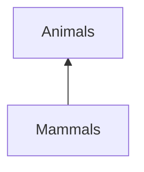

# `class`

## Analogy

Animal taxonomy is the grouping or categorization of animals into an outline or tree structure. In the scientific classification system, biologists group and categorize every organism, living or extinct, into **kingdom**, **phylum**, **class**, **order**, **family**, **genus**, and **species**.

It is important to note that a `class` is a more abstract concept and a programming pattern by which program writers organize information, and it 


>   Python `class`es are objects that encapsulate and organize information in a Python program.

Let us take animals as an example. If you look at animals as a group, you notice that some of them share certain attributes that are in common.

*   Cats and dogs both have legs.
*   Flying insects and birds have wings.
*   Salmon and Mackerel both have fins.

Even some of the different groups of animals share attributes with each other as well.

*   Cats and flying insects both have legs.
*   Birds and salmon both have skin.
*   Mackerel and dogs both have eyes.

You may start to notice a pattern in that some of the attributes are "re-used" from one animal to another.

Let us take a look at the animal example again and break them down into smaller concepts and look at them from a more abstract level.

* A dog is a type of mammal.
* A cat is a type of mammal.
* When a dog makes a sound, it barks.
* When a cat makes a sound, it meows.
* Mammals are a type of animal.
* Mammals have hair.

First of all, we have claimed that **mammals** have hair, and that it is a type of **animal**. If we think abstractly about the relationship between the terminology "mammals" and "animals", we can say that mammals go under the cateogory of animals.




Python classes are just another way of representing this sort of information. The following is how we can convert the above example into Python code.

```python
class Animal:
    def make_sound(self):
        pass
    def has_hair(self):
        pass

class Mammal(Animal):
    def has_hair(self):
        return True

class Dog(Mammal):
    def make_sound(self):
        return "bark!"

class Cat(Mammal):
    def make_sound(self):
        return "meow!"
```
